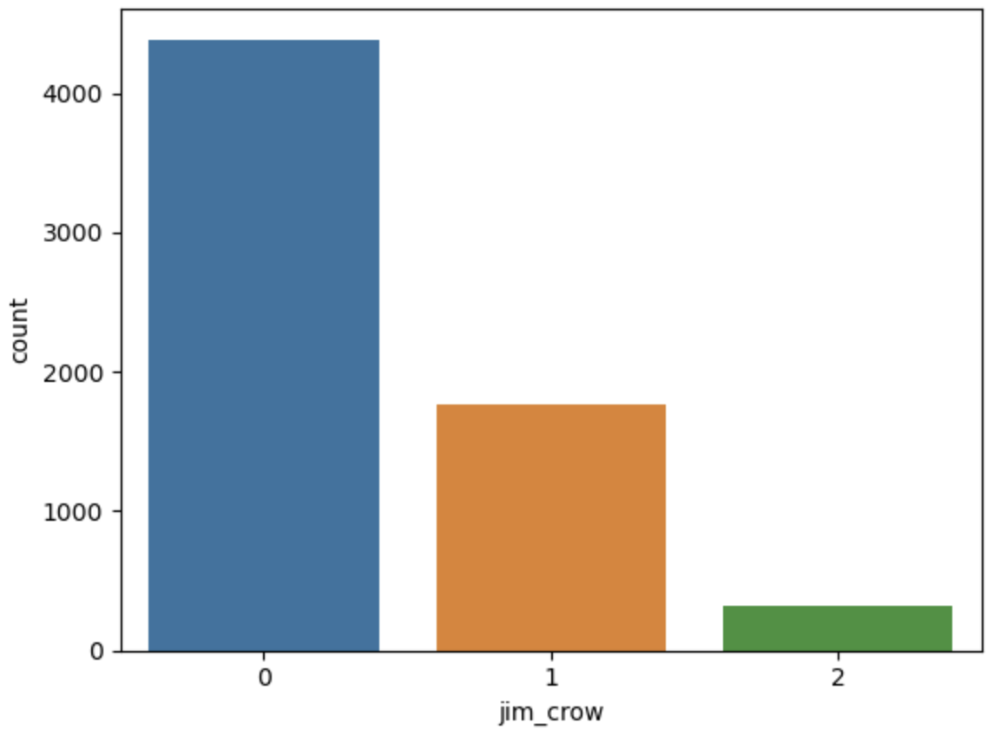

# Classification

In the classification phase, supervised learning methods were explored and used to identify Jim Crow laws within the corpus.

Unlike the outputs of the sentence cleaning phase, the classification models only utilized two types of features to output the Jim Crow target label:

- A numerical feature for the year
- A text feature for the act

The target was a 3-class output of either a 0, 1, or 2 which represented not Jim Crow, Jim Crow, and maybe Jim Crow respectively.

Law scholars helped assemble training sets. Since the majority of laws are not of Jim Crow language, our training sets were imbalanced in favor of an output of 0. An example of the distribution of the target variables of an early training set is shown below.

To resolve this issue, [SMOTE](https://www.jair.org/index.php/jair/article/view/10302) oversampling techniques were used to achieve better results.

Preprocessing, using [NLTK](https://www.nltk.org/), was done on the features to convert string features to a numeric representation. To avoid data leakage during preprocessing, pipelines were used to incorporate the various steps. To quantify the results of the models, F1 scores were considered and improved using grid search cross-validation, to find ****optimal parameter values. Furthermore, expert reviews of initial model runs were used to improve the model.

As a preliminary model, [XGBoost](https://xgboost.readthedocs.io/en/stable/) was used and [scikit learn](https://scikit-learn.org/) was used throughout this phase for aiding with machine learning.