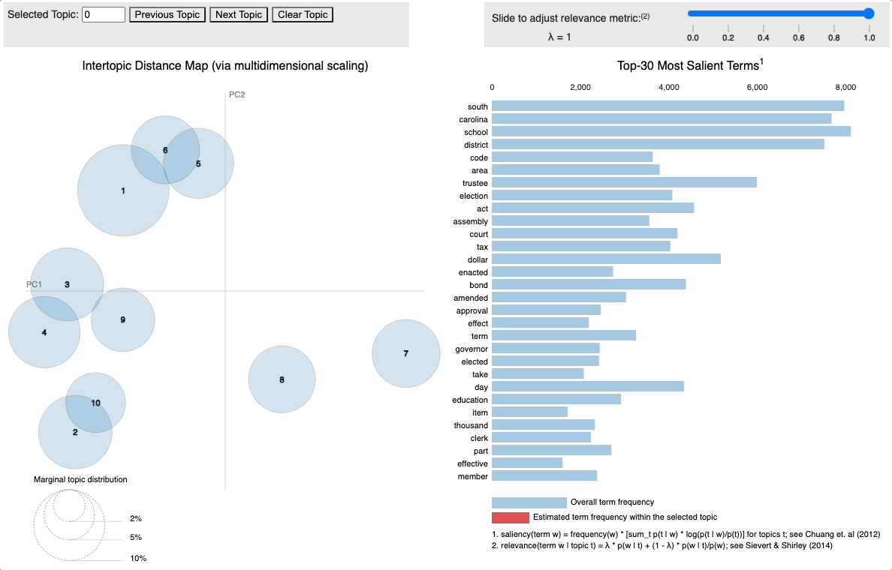

# Corpus Analysis

The corpus analysis phase explores the underlying characteristics behind laws from South Carolina.

### Most frequent and TF-IDF

`corpus_analysis.ipynb` find the most frequent words (along with their scores) for each year. It also finds the top bi-gram and tri-gram TF-IDF words and scores for those years.

### LDA

`LDA.ipynb` uses an unsupervised method, Latent Dirichlet Allocation (LDA), to build a topic model for the laws.
  A visualization of an early LDA model is show below,
 

Some explanation for the interactive visualization:
  - In the visualization, the topics are represented by the bubbles and sorted by their size.
  - The blue bars on the right side are the total frequency of the word in the corpus. The red bars give the number of times the term was present in the selected topic.
  - If no topic is chosen, then the blue bars show the most frequent words.
  - In the graph on the left, the distance between the bubbles indicates the uniqueness. For example, the closer the bubbles are to each other, the more similar they are.    
  - <b>Hands On: </b> You can try the latest version of this visualization (which is the `LDA_vis.html` file in this directory) by clicking [this link](https://htmlpreview.github.io/?https://github.com/g-nitin/OnTheBooksUofSC/blob/main/corpus_analysis/LDA_vis.html).
    
    This link takes you to the _htmlpreview.github.io_ host for the visualization HTML file. About `htmlpreview` (from their [GitHub](https://github.com/htmlpreview/htmlpreview.github.com)): _Many GitHub repositories don't use GitHub Pages to host their HTML files. GitHub & BitBucket HTML Preview allows you to render those files without cloning or downloading whole repositories. It is a client-side solution using a CORS proxy to fetch assets._

The final model was build from `LDA_best_hyperopt.py`, the file that was used to hypertune the parameters for the final LDA model, and read in `LDA.ipynb`, which was used to create the `LDA_vis.html` file.

The final list of topics, with the 10 most relevant words, is given in `lda_topics.txt`.

### LDA Visualizations

  Using the outputs from the LDA model and predicted Jim Crow labels, some visualizations were made to explore the corpus in detail.

  The code and explanations for these visualizations is described in the `LDA_visualizations.ipynb` and the final plots are stored in the `imgs` subdirectory. Note that the `checkpoint` subdirectory stores all data, such lda models and cleaned sentences, and the `stopwords` subdirectory contains the list of stopwords used for the model.

  Visualizations:

1. **Stack Plot for Topic Distribution over Time:** Visualizes the distribution of topics over time, showing how the prevalence of different topics changes across different time periods. Saved in `imgs/topic_evolution.png` and `imgs/topic_evolution_decade.png`.

2. **Topic Distribution by Jim Crow:** Illustrates the distribution of topics across different categories of Jim Crow language labels, revealing how topics vary based on the presence or absence of Jim Crow language. Saved in `imgs/topic_dist_jc.png`.

3. **Topic Co-occurrence with Jim Crow Language:** Displays the co-occurrence of topics with Jim Crow language labels, indicating which topics are frequently associated with the presence of Jim Crow language. Saved in `imgs/topic_coucc_jc.png`.

4. **Jim Crow Language Proportion Over Time:** Depicts the proportion of sentences containing Jim Crow language over time, highlighting the temporal dynamics of Jim Crow language usage. Saved in `imgs/jc_prop_time.png`.

5. **Word Cloud for Jim Crow Language:** Visualizes the most frequent words associated with Jim Crow language, providing insights into the vocabulary and language patterns related to Jim Crow-era discourse. Saved in `imgs/word_cloud_jc.png`.

6. **Word Clouds for Topics:** Illustrates the most frequent words associated with each topic identified by the LDA model, offering a visual overview of the thematic content and key terms for each topic. Saved in `imgs/word_cloud_topics.png`.